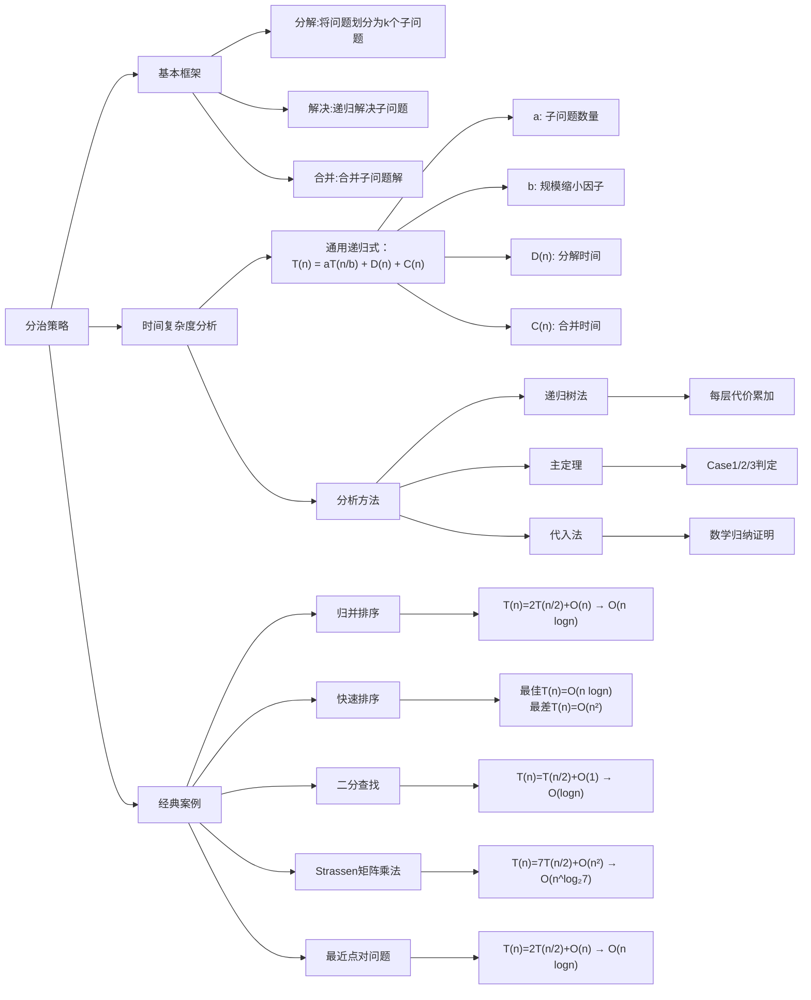
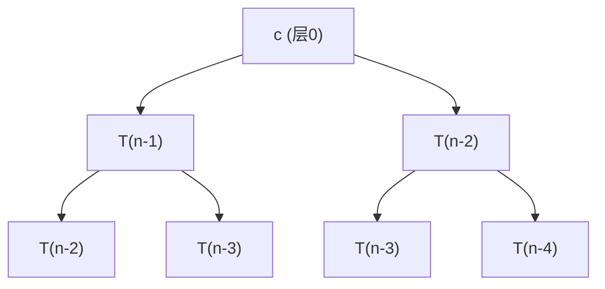
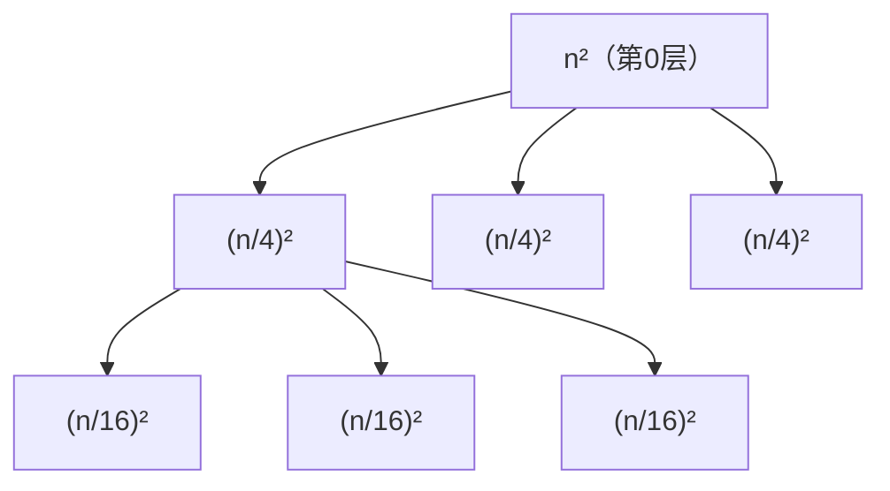

## 算法引入

在解决较困难问题时我们可以将问题拆解，直到拆解为规模足够小的问题，我们称之为**基本情况**。同时需要注意：子问题的规模不必是原问题规模的一个固定比例。例如：分治排序若每次将数组分为长度为n-1和1的两组，其递归时间复杂度为 $T(n) = T(n-1) + O(1)$

另外在设计分治算法时要特别注意边界条件的设置

对于几个常见例子：最大化连续区间和、传统矩阵分治乘法（相比BF无优化）、矩阵乘法Strassen算法等，本笔记只着重于Strassen算法的内容整理。

### Strassen算法

传统矩阵算法步骤如下：

$$
C_{i,j} = \sum_{k=1}^{n} A_{i,k}B_{k,j} \quad \Rightarrow O(n^3)
$$

基本步骤如下：

1. 将将n×n矩阵分割为4个(n/2)×(n/2)子矩阵
2. 递归计算7个矩阵乘积
3. 通过加减组合得到结果矩阵

接下来以2x2矩阵举例，其算法关键在于其计算的7个矩阵乘积

$$
A = \begin{bmatrix}
A_{11} & A_{12} \\\
A_{21} & A_{22}
\end{bmatrix}, \quad
B = \begin{bmatrix}
B_{11} & B_{12} \\\
B_{21} & B_{22}
\end{bmatrix} 
$$
$$
\begin{aligned}
M_1 &= (A_{11}+A_{22})(B_{11}+B_{22}) \\\
M_2 &= (A_{21}+A_{22})B_{11} \\\
M_3 &= A_{11}(B_{12}-B_{22}) \\\
M_4 &= A_{22}(B_{21}-B_{11}) \\\
M_5 &= (A_{11}+A_{12})B_{22} \\\
M_6 &= (A_{21}-A_{11})(B_{11}+B_{12}) \\\
M_7 &= (A_{12}-A_{22})(B_{21}+B_{22})
\end{aligned}
$$

$$
C = \begin{bmatrix} M_1+M_4-M_5+M_7 & M_3+M_5 \\\ M_2+M_4 & M_1-M_2+M_3+M_6 \end{bmatrix}
$$

其复杂度分析：

$$
T(n) = \begin{cases} O(1) & \text{当 } n=1 \\\ 7T(n/2) + 18(n/2)^2 & \text{当 } n>1 \end{cases}
$$
关键在于 $T(n/2)$ 前的系数由传统方法的8降为了7，在大矩阵乘法计算时优势极为明显。接下来学习如何化简递推式。

## 分治算法时间复杂度的分析

### 代入法

4. 猜测解的形式
5. 使用数学归纳法证明

关键在于如何“猜”：Attention is all your need。但是存在一些启发式的方法帮助猜测；或者是先证明递归式较松的上界和下界，运用类似夹逼的思想逼近紧确界

### 递归树方法

注意到，不是每个人都有很强的注意力，所以我们可以使用**递归树**方法计算。下面说明递归树计算方法：

首先构造 $T(n) = aT(n/b) + f(n)$ 的递归树：

- 根节点：$f(n)$ （当前层代价）
- 子节点：共 $a$ 个分支，每个分支对应 $T(n/b)$
- 递归构造直到叶子结点 $T(1)$

第i层特征：
$$
\begin{cases}
递归深度: i \\\
问题规模: n/b^i \\\
节点数: a^i \\\
每层总代价: a^i \cdot f(n/b^i)
\end{cases}
$$

通过树的知识，我们容易确定树高： $\log_b n$ 

最后通过求和计算整棵树的代价：

$$
T(n) = \sum_{i=0}^{\log_b n} \left( a^i \cdot f(n/b^i) \right)
$$

接下来举几个案例来更具体地说明：

#### 归并排序

$$
T(n) = 2T(n/2) + O(n)
$$

$$
\begin{align*}
T(n) &= \sum_{i=0}^{\log_2 n} cn \\\
     &= cn \times (\log_2 n + 1) \quad \\\
     &= cn\log_2n + cn \\\
     &= \Theta(n\log n)
\end{align*}
$$

#### 二分查找

$$
T(n) = T\left(\frac{n}{2}\right) + c \quad (c>0)
$$

$$
\begin{align*}
T(n) &= \sum_{i=0}^{\log_2 n} c \\\
     &= c \times (\log_2 n + 1) \\\
     &= c\log_2n + c \\\
     &= \Theta(\log n)
\end{align*}
$$

#### 斐波那契数列

$$ T(n) = T(n-1) + T(n-2) + c \quad (c>0 ) $$

通过特征方程法求解齐次递推关系：

$$
r^2 = r + 1 \quad \Rightarrow \quad r = \frac{1 \pm \sqrt{5}}{2}
$$

得：

$$
T(n) = A\left(\frac{1+\sqrt{5}}{2}\right)^n + B\left(\frac{1-\sqrt{5}}{2}\right)^n
$$

由于

$$
\frac{1+\sqrt{5}}{2} \approx 1.618, \quad \frac{1-\sqrt{5}}{2} \approx -0.618
$$

当 $n \rightarrow \infty$  负项可被忽略

$$
T(n) \approx A(1.618)^n = O\left( \left(\frac{1+\sqrt{5}}{2}\right)^n \right) \subset O(2^n)
$$

显然，这是一个效率极低的方法，记忆化递归的方法可以使用哈希表存储已计算结果，减少重复计算

#### 更复杂的递推式

接下来用一个较为复杂的递推式来说明：

$$T(n) = 3T(\frac n4)+n^2 = \sum_{i=0}^{\log_4 n} \left( \frac{3}{16} \right)^i n^2$$

首先展开有限级数，运用等比数列求和公式

$$
S = \frac{16}{13}\left[1 - \left(\frac{3}{16}\right)^{\log_4 n + 1}\right]
$$

$$
\left(\frac{3}{16}\right)^{\log_4 n} = e^{\ln(3/16) \cdot \log_4 n} = n^{\log_4(3/16)}
$$

$$
S = \frac{16}{13}\left[1 - \frac{3}{16} \cdot n^{-2 + \log_4 3}\right]
$$

$$
S = \frac{16}{13} - \frac{3}{13} \cdot n^{-2 + \log_4 3}
$$

观察指数项：

$$
-2 + \log_4 3 \approx -1.2075 < 0
$$

所以 $n \rightarrow \infty$ 时有  

$$
T(n) = n^2 \cdot S = n^2 \left( \frac{16}{13} - o(1) \right) = \Theta(n^2)
$$

### 主定理

先给出主定理：

对于形如 $T(n) = aT(n/b) + f(n)$ 形式的递推式，其中 $f(n)=\Theta(n^k \log^p n), a \ge 1, b > 1, k \ge 0$  

$$
\begin{equation*}
T(n) = \begin{cases}
\Theta\left(n^{\log_b a}\right) & \text{若 } a > b^k \\\
\Theta\left(n^{\log_b a} \cdot \begin{cases}
\log^{p+1} n & p > -1 \\\
\log \log n & p = -1 \\\
1 & p < -1
\end{cases}\right) & \text{若 } a = b^k \\\
\Theta\left(n^k \cdot \begin{cases}
\log^p n & p \geq 0 \\\
1 & p < 0
\end{cases}\right) & \text{若 } a < b^k
\end{cases}
\end{equation*}
$$

计算时直接代入即可

对于这几种情况的直观解释如下：

6. **叶子主导型**：这种情况中每个节点的子节点极多，子节点的个数对复杂度影响大
7. **均衡型**：这种情况二者对时间复杂度的影响程度相近
8. **根主导型**：合并操作的时间复杂度较大，对最终复杂度影响大