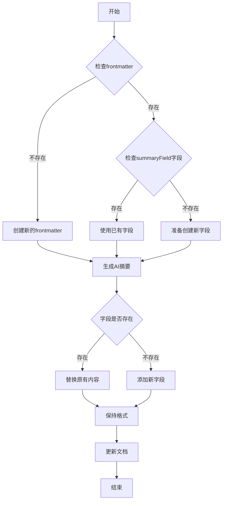

## 开发缘由

在使用 obsidian+hugo 的博客配置时，发现需要文章的概括内容，于是决定直接从 obsidian 端实现该功能。

## 主要实现

### openai请求

采用 obsidian 推荐的 requesturl 库进行大模型请求


```TS
export class OpenAIService {
    constructor(apiKey: string, baseUrl: string, model: string, systemPrompt: string) {
        this.apiKey = apiKey;
        this.baseUrl = baseUrl;
        this.model = model;
        this.systemPrompt = systemPrompt;
    }

    private async makeRequest(messages: ChatMessage[]): Promise<string> {
        try {
            const response = await requestUrl({
                url: `${this.baseUrl}/v1/chat/completions`,
                method: 'POST',
                headers: {
                    'Authorization': `Bearer ${this.apiKey}`,
                    'Content-Type': 'application/json',
                },
                body: JSON.stringify({
                    model: this.model,
                    messages,
                    temperature: 0.7,
                    max_tokens: COMPLETION_TOKENS,
                }),
            });
            // 处理响应...
        } catch (error) {
            // 错误处理...
        }
    }
}
```

## formatter内容修改处理

考虑到添加的字段名有个性化需求，因此在设置中可让用户自行设定添加的字段名，对多种不同的格式有较好适配性。

针对formatter修改有如下方案可选：
- 使用YAML解析器
- 正则表达式

个人对正则表达式比较熟悉，最终采用正则表达式进行


```TS
private static readonly FRONTMATTER_REGEX = /^---\n([\s\S]*?)\n---\n*/;
private static readonly FIELD_REGEX = (field: string) =>
new RegExp(`^${field}:([\\s\\S]*?)(?=\\n[^\\s]|$)`, 'm');
```

### 错误处理

请求遇到错误时抛出相对应的错误类型

```TS
   try {
       // API调用
   } catch (error) {
       if (error.status === 429) {
           new Notice('API rate limit exceeded. Please try again later.');
       } else if (error.status === 401) {
           new Notice('Invalid API key. Please check your settings.');
       } else {
           new Notice(`API Error: ${error.message}`);
       }
       throw error;
   }
```

## 总结

经过开发，终于可以为博客文章自动生成描述，方便阅读和后续检索

开源地址：[GitHub](https://github.com/DanielZhangyc/Auto-AI-Summary)