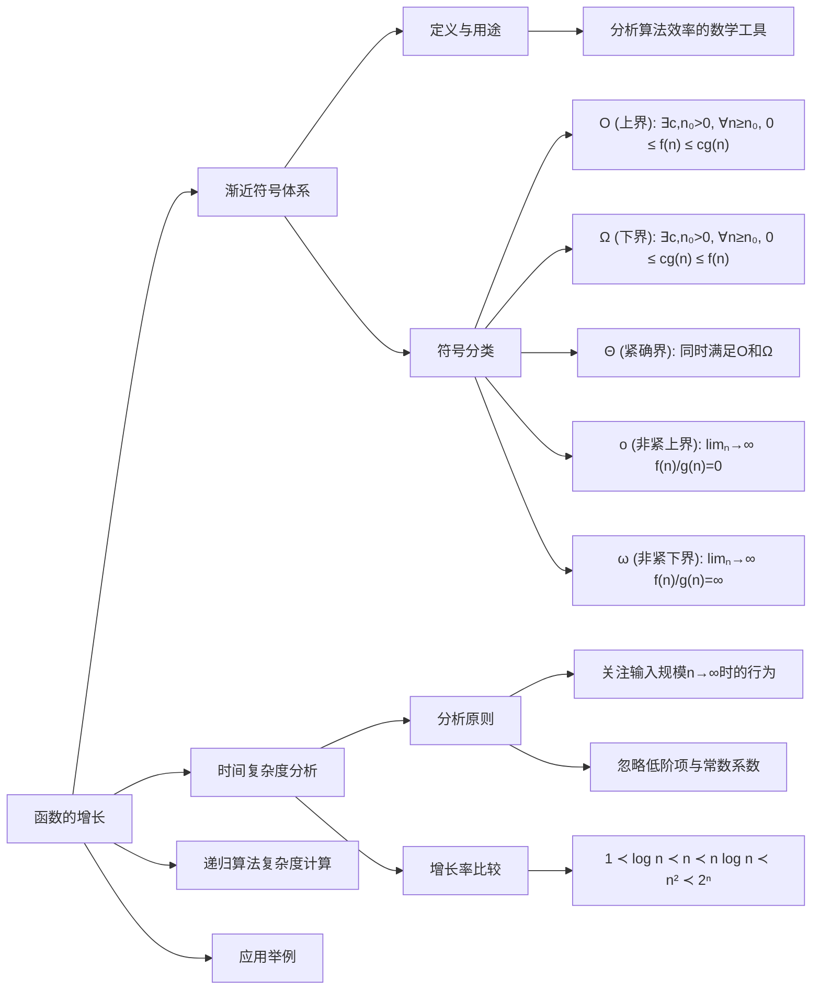
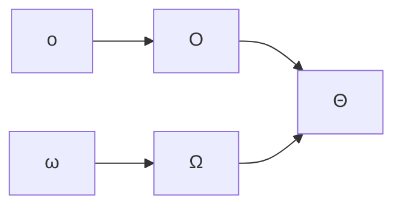

## 思维导图



## 渐近符号体系
### 1. 核心符号定义
| 符号           | 数学定义                              | 直观含义       | 典型用例             |
| ------------ | --------------------------------- | ---------- | ---------------- |
| **O** (上界)   | $∃c,n₀>0，∀n≥n₀，0 ≤ f(n) ≤ c·g(n)$ | 算法的最坏时间复杂度 | 插入排序最坏情况 O(n²)   |
| **Ω** (下界)   | $∃c,n₀>0，∀n≥n₀，0 ≤ c·g(n) ≤ f(n)$ | 算法的最低性能保证  | 比较排序下限 Ω(n logn) |
| **Θ** (紧确界)  | $同时满足 O(g(n)) 和 Ω(g(n))$          | 算法的精确时间范围  | 归并排序 Θ(n logn)   |
| **o** (非紧上界) | $limₙ→∞ f(n)/g(n) = 0$            | 严格弱于上界     | 2n = o(n²)       |
| **ω** (非紧下界) | $limₙ→∞ f(n)/g(n) = ∞$            | 严格强于下界     | n² = ω(n logn)   |

### 2. 符号关系


---
## 时间复杂度分析
### 1. 三大基本原则

1. 忽略常数因子：硬件差异会掩盖常数影响  
2. 关注最高阶项 ：长期增长趋势由最高阶主导
3. 考虑最坏情况：保证算法在任何输入下的性能下限

### 2. 常见函数增长率

$$ 1 \prec \log n \prec \sqrt{n} \prec n \prec n \log n \prec n^2 \prec 2^n $$


当 n=1,000,000 时  

  ```python
  log2(n) ≈ 20      # 对数级
  n = 1e6           # 线性级
  n logn ≈ 20e6     # 线性对数级
  n² = 1e12         # 平方级
  ```


